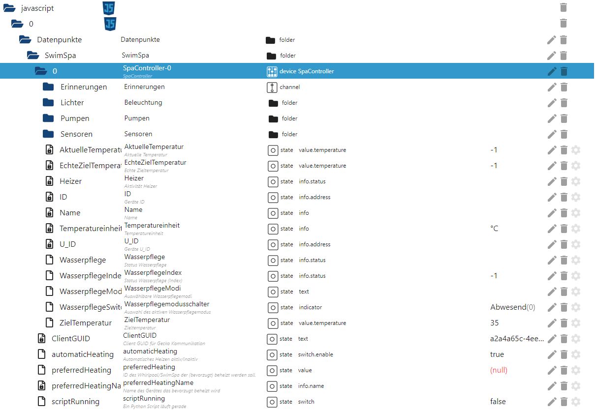

<!-- TOC -->

- [ioBroker Skript Integration von Gecko Alliance spa pack systems bzw. in.touch2 mit geckolib](#iobroker-skript-integration-von-gecko-alliance-spa-pack-systems-bzw-intouch2-mit-geckolib)
  - [Funktionsumfang](#funktionsumfang)
  - [Installation/Update](#installationupdate)
    - [gazoodle/geckolib (github)](#gazoodlegeckolib-github)
    - [Python Skripte](#python-skripte)
    - [Javascript Skripte für ioBroker](#javascript-skripte-für-iobroker)
      - [Voraussetzungen](#voraussetzungen)
      - [Schritt 1: Skript SpaGlobal.js bereitstellen](#schritt-1-skript-spaglobaljs-bereitstellen)
      - [Schritt 2: Erstellen bzw. Aktualisieren der Datenpunkte](#schritt-2-erstellen-bzw-aktualisieren-der-datenpunkte)
      - [Schritt 3: Skripte für Spa Controller Konfiguration und Update der Zustände](#schritt-3-skripte-für-spa-controller-konfiguration-und-update-der-zustände)
      - [Schritt 4: Weitere Skripte nach Bedarf](#schritt-4-weitere-skripte-nach-bedarf)
  - [Visualisierung](#visualisierung)
- [Todo's](#todos)

<!-- /TOC -->

# ioBroker Skript Integration von Gecko Alliance spa pack systems bzw. in.touch2 mit geckolib

## Funktionsumfang

* [X] Unterstützung mehrere Spa Controller
* [X] Bereitstellen von Datenpunkten mit der Konfiguration des Spa Controllers
* [X] Bereistellen von Datenpunkten mit aktuellen Laufzeitinformationen (z.B. Temperatur usw.)
* [X] Schalten der Pumpen
* [X] Schalten der Beleuchtung
* [X] Einstellen der Zieltemperatur
* [X] Einstellen des Wasserpflegemodus
* [ ] ToDos unten umsetzen

## Installation/Update
Hier auf Github werden 2 Arten von Skripten bereitgestellt:
1. Python-Skripte im Ordner: [Pyhton](Python), über die das geckolib API angesprochen wird
2. Javascript-Skripte im Ordner: [Javascript](JavaScript), welche im Javascript Adapter angelegt werden müssen

### gazoodle/geckolib (github)
Quelle: [https://github.com/gazoodle/geckolib](https://github.com/gazoodle/geckolib)

Voraussetzung zur Installation: **Python3** & **Pip** (am besten unter einem Linux)

Installation: `sudo pip install geckolib` 
Update: `sudo pip install geckolib --upgrade` 

Auch die geckolib muss ab und an mal aktualisiert werden.

### Python Skripte
Alle Python Skripte aus dem Repository (Ordner: [Python](Python)) in einem Verzeichnis bereitstellen. Die Python-Skripte werden von den Javascript-Skripten aus aufgerufen mit den nötigen Parametern. 

**Wichtig:** ioBroker benötigt Zugriff auf die Python-Skripte, der Ablageort kann z.B. `/opt/iobroker/node_modules/iobroker.javascript` sein, dann geht der Aufruf ohne Anpassung des Pfades, bei anderen Pfaden, dran denken die Rechte korrekt einzustellen und dann muss in den Javascripten der voll qualifizierte Pfad zu den Python-Skripten eingetragen werden!

### Javascript Skripte für ioBroker
#### Voraussetzungen
* Adapter: Simple Rest API installiert und eine Instanz am laufen
* Adapter: Javascript/Blockly installiert und eine Instanz am laufen
* Konfiguration des Javascript Adapters anpassen:
  * Option: Enable Command "setObject" - ist aktiviert
  * Option: Enable Command "exec" - ist aktiviert

#### Schritt 1: Skript SpaGlobal.js bereitstellen

* "Expert Mode" im Adapter aktivieren, damit der Ordner `global` angezeigt wird
* im Ordner `global` ein neues Skript `SpaGlobal` anlegen und den Inhalt der Datei [SpaGlobal.js](JavaScript/global/SpaGlobal.js) hineinkopieren und evtl. Konfiguration anpassen:

| **Variable** | **Verwendungszweck/Wert** |
| ------------ | ----------------------------------------------------------------------------------------------------------------------------- |
| `BASE_ADAPTER` | Basispfad zum Adapter unter dem die Datenpunkte angelegt werden. Standard ist der erste Javascript Adapter: "javascript.0". |
| `BASE_FOLDER`  | Basispfad unter dem die Datenpunkte angelegt werden sollen, Standardwert ist: "Datenpunkte.SwimSpa" |
| `SPA_EXECUTEABLE` | Auszuführendes Programm, Standard ist "python3" |

#### Schritt 2: Erstellen bzw. Aktualisieren der Datenpunkte
* Neuen Ordner `Spa` im Javascript Adapter anlegen um alle folgenden Skripte an einen Ort zu abzulegen
* Neues Skript `SpaVariablen` in diesem Ordner anlegen und den Inahlt von [SpaVariablen.js](JavaScript/SpaVariablen.js) einspielen
* den Aufruf der Funktion createDatapoints() anpassen:

| **Parameter** | **Wert**                                       |
| ------------- | ---------------------------------------------- |
| 1             | Anzahl Spa Controller im Netz, typ. Weise: 1   |
| 2             | Anzahl Pumpen pro Spa Controller, typ. Weise 3 |
| 3             | Datenpukte für Wasserfall mit anlegen          |

* Nach dem Speichern, das Script 1x ausführen
* Prüfen ob die Datenpunkte vorhanden sind, der Objektbau sollte so aussehen:

#### Schritt 3: Skripte für Spa Controller Konfiguration und Update der Zustände
* Neues Skript: `SpaUpdateConfig` im Ordner `Spa` erstellen und den Inhalt von [SpaUpdateConfig.js](JavaScript/SpaUpdateConfig.js) einfügen
* Die Javascript Funktion: `updateSpaConfig()` wird beim speichern 1x ausgeführt, danach aller 6h.
* Jetzt prüfen ob die Datenpunkte die eher statische Konfigurationswerte darstellen, wie (z.B.: Temepratureinheit, ID, U_ID) aktualisiert worden sind.
* Neues Skcript: `SpaUpdateValues` im Ordner `Spa` erstellen und den Inhalt von [SpaUpdateValues.js](JavaScript/SpaUpdateValues.js) einfügen
* Das Skript wird minütlich aufgerufen und aktualisiert alle anderen Werte wie z.B. die Wassertemperaturen, Pumpenstatus, Licht usw.

**Hinweis:** Wenn die Python Scripte in einem speziellen Ordner liegen, dann muss der Pfad ggf. im Javascript-Skript im exec()-Aufruf angepasst werden.

#### Schritt 4: Weitere Skripte nach Bedarf

* Falls nicht vorhanden einen neuen Ordner `Spa` im JavaScript-Adapter anlegen (um die Skripte etwas zu sortieren)
* Skripte bereitstellen:

| **Zweck**                    | **Javascript**              | **Python Skript**           |
| ---------------------------- | --------------------------- | --------------------------- |
| Schalten der Pumpen          | `PumpSwitches` (Datei: [PumpSwitches.js](JavaScript/PumpSwitches.js)) | `spa_switchPump.py clientId restApiUrl spaId pumpId newPumpState pumpChannel` |
| Schalten der Beleuchtung     | `LightToggle` (Datei: [LightToggle.js](JavaScript/LightToggle.js)) | `spa_toggleLight.py clientId restApiUrl spaId lightKey lightChannel` |
| Setzen der Zieltemperatur    | `TargetTemp` (Datei: [TargetTemp.js](JavaScript/TargetTemp.js)) | `spa_setTargetTemp.py clientId restApiUrl spaId targetTemp targetTempDatapoint` |
| Setzen des Wasserpflegemodus | `WatercareMode` (Datei: [WatercareMode.js](JavaScript/WatercareMode.js)) | `spa_setWatercareMode.py ClientGUID SpaId waterCareModeIdx devicePath` |

**Hinweis:** Wenn im vorhergehenden Schritt bei BASE_ADAPTER bzw. BASE_FOLDER abweichende Pfade angegeben worden sind, müssen diese in den on()-Aufrufen ebenfalls angepasst werden.

## Visualisierung

[Hier](doc/visualization.md) mal ein Beispiel für eine Visualisierung mit vis im ioBroker.

# Todo's

* [X] Momentan ist der Pfad zu den Datenpunkten in den Python Scripten noch fest codiert - umstellen auf Parameter nötig
* [X] Die URL vom ioBroker Rest API muss als Parameter mit übergeben werden
* [X] Alle Python Skripte sollen ohne Konstanten aufrufbar sein
* [X] Statt cron soll der regelmäßige Aufruf mit ioBroker Schedule möglich sein
* [ ] Status der Erreichbarkeit des Spa in Datenpunkt darstellen (Ebene Netzwerk, Online/Offline), sowie Fehler bei letzten Kommando
* [ ] Richtiges Discovery der Eigenschaften des Spa Controllers anstatt feste Anlage der Datenpunkte via Skript
* [ ] Das setzen der Zieltemperatur ist empfindlich ggü. mehreren schnell auseinanderfolgenden Wertänderungen. Momentan am besten einen Slider nutzen, der eine Funktion "Update value on release" untersützt, so dass der DP nur einmal geändert wird. Das Script braucht immer ein paar Sekunden bis der Wert im Hintergrund gesetzt wurde.
* [ ] Aktuell funktionieren die Erinnerungen nicht, da die geckolib keine Werte zurückgibt
* [ ] Das Auslösen einer Aktion (Licht an/aus, Pumpe an/aus) braucht ca. 15 Sekunden bis es umgesetzt ist (liegt am Verbindungsaufbau der recht lange dauert bei der geckolib)
* [ ] Pfad zu den Python Skripten global konfigurierbar machen und die Anleitung dahingehend anpassen (auch Skriptbereitstellung)
* [ ] ...
