# Inhalt
<!-- TOC -->

- [Inhalt](#inhalt)
- [Beispiel für eine Visualisierung](#beispiel-f%C3%BCr-eine-visualisierung)
- [Elemente zu Steuerung eines Spa Controllers](#elemente-zu-steuerung-eines-spa-controllers)
    - [1. Temperaturen und sonstige Werte](#1-temperaturen-und-sonstige-werte)
    - [2. Auswahl des Wasserpflegemodus](#2-auswahl-des-wasserpflegemodus)
    - [3. Zieltemperatur](#3-zieltemperatur)
    - [4. Schalten von Licht](#4-schalten-von-licht)
    - [5. Pumpen- oder Filterstatus](#5-pumpen--oder-filterstatus)

<!-- /TOC -->

# Beispiel für eine Visualisierung

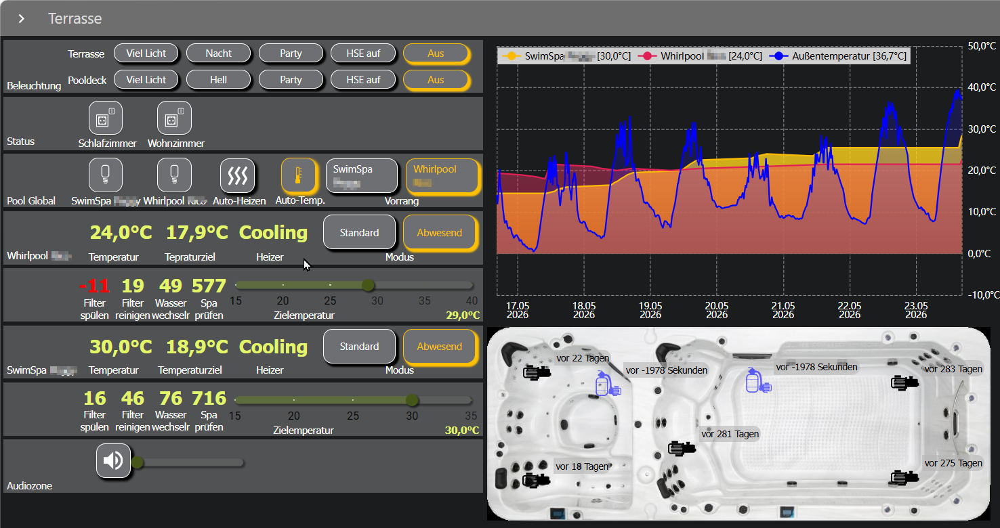
Visualisierung für ein 10 Zoll Display horizontal. Parktisch kann jedes beliebige Widget verwendet werden. Es ist wichtig, dass die Datenpunkte selbst mit ack = false gesetzt werden (das ist eigentlich das Standardverhalten).

Der Chart ist mit eChart erstellt, die Datenpunkte können z.B. mit dem "SQL logging" Adapter in einer mariaDB aufgezeichnet werden (geht aber praktisch auch alles andere was ioBroker unterstürzt).

# Elemente zu Steuerung eines Spa Controllers
## Temperaturen und sonstige Werte
Basic Number Widget: 
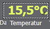 

Konfiguration:  
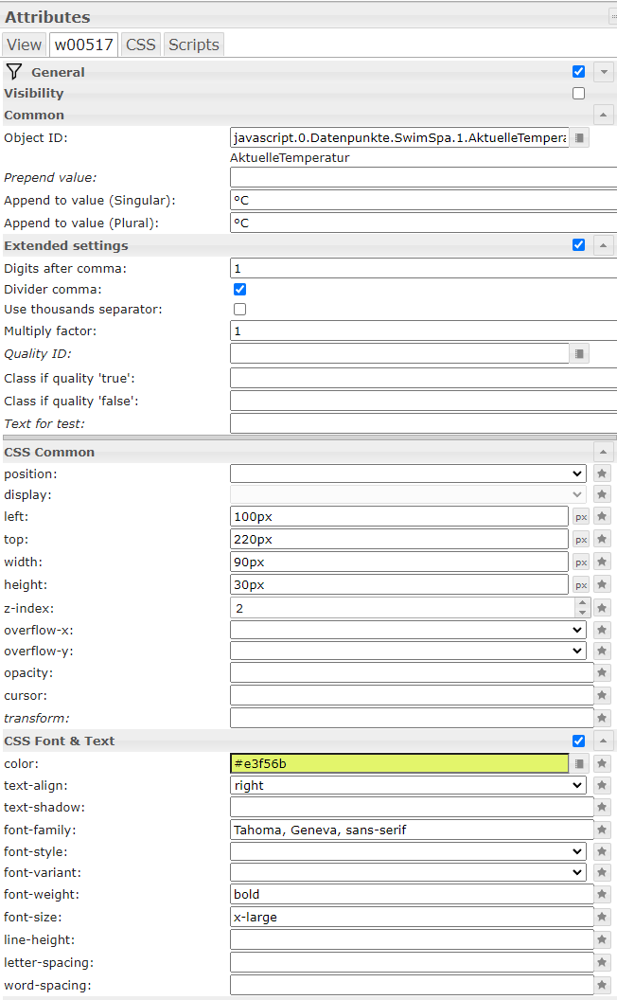 

## Auswahl des Wasserpflegemodus
inventwo design: Universal (Schalter, Taster, Nav & mehr): 
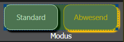 

Konfiguration:  
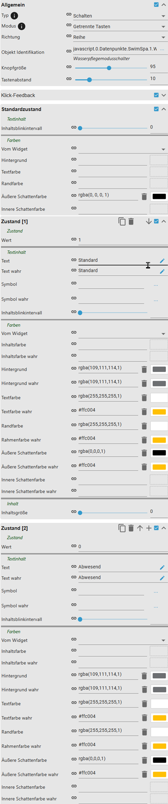 

## Zieltemperatur
inventwo design: Schieberegler:  
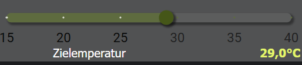 

Konfiguration:  
**Wichtig:** Der Slider darf den Wert erst am Ende setzen (Option: "Update value on release" unbedingt aktivieren!)
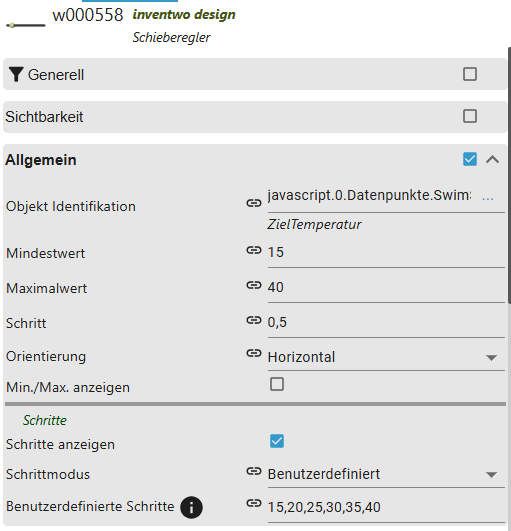

## Schalten von Licht
vis-inventwo - Universal Switch:  
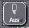 
Diese Button müsste sich auch für Pumpen eignen, die nur 2 Stufen (OFF & HIGH) haben, da man den Wert beinflussen kann.

Konfiguration:  
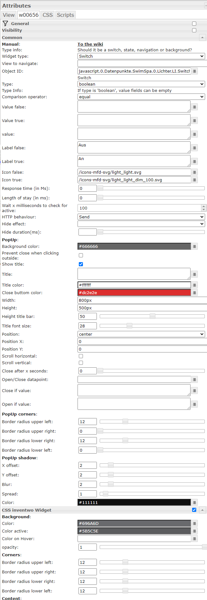
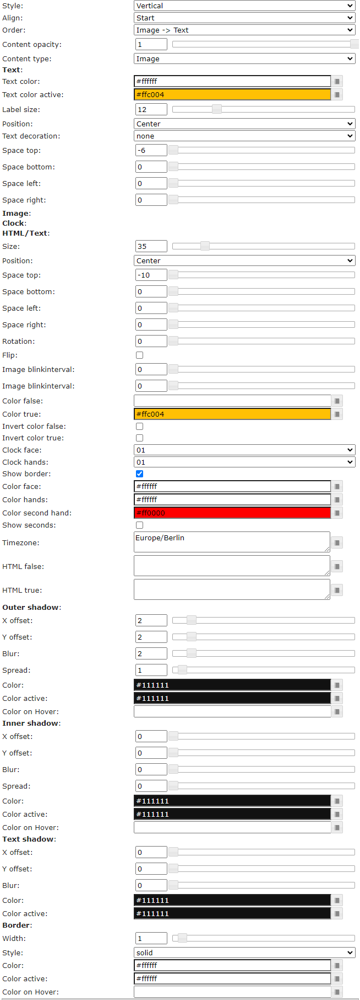

## Pumpen- oder Filterstatus
vis-Inventwo - Image:  
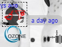 

Konfiguration:  
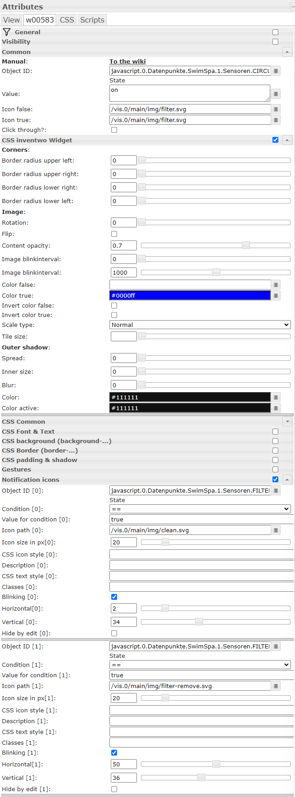
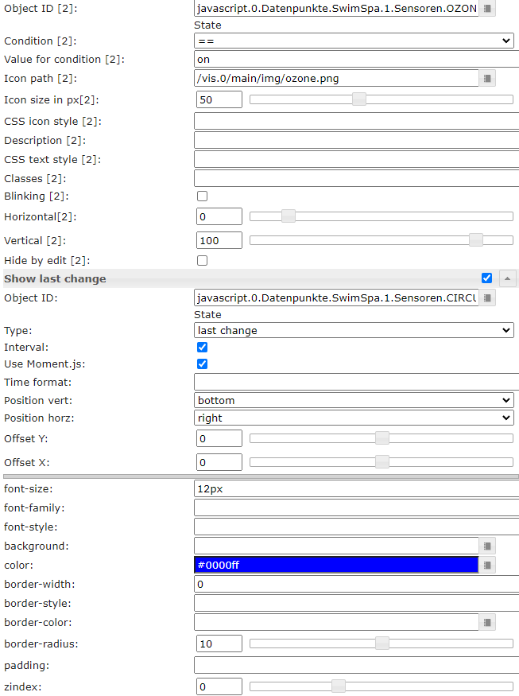