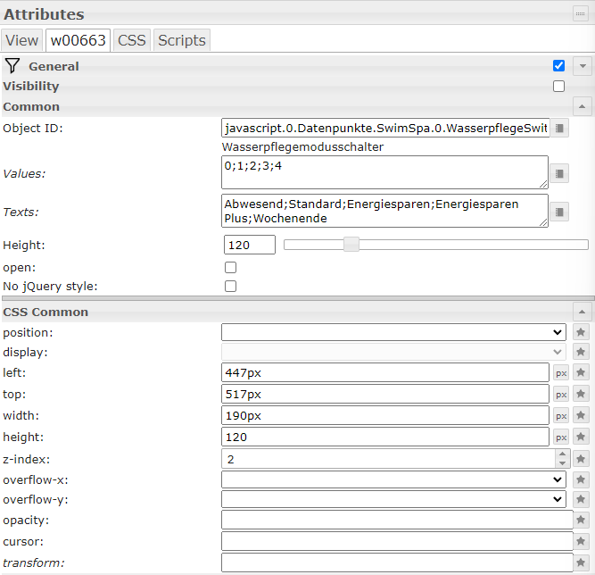

# Beispiel für eine Visualisierung

Visualisierung für ein 10 Zoll Display horizontal. Parktisch kann jedes beliebige Widget verwendet werden. Es ist wichtig, dass die Datenpunkte selbst mit ack = false gesetzt werden (das ist eigentlich das Standardverhalten).

Der Chart ist mit eChart erstellt, die Datenpunkte können z.B. mit dem "SQL logging" Adapter in einer mariaDB aufgezeichnet werden (geht aber praktisch auch alles andere was ioBroker unterstürzt).

# Elemente zu Steuerung eines Spa Controllers
## Temperaturen und sonstige Werte
Basic Number Widget: 
 

Konfiguration:  
 

## Combobox zur Auswahl des Wasserpflegemodus
jqui - Select ValueList: 
 

Konfiguration:  
 

## Slider für die Zieltemperatur
vis-inventwo - Simple Slider:  
 

Konfiguration:  
**Wichtig:** Der Slider darf den Wert erst am Ende setzen (Option: "Update value on release" unbedingt aktivieren!)

## Button zum Schalten von Licht
vis-inventwo - Universal Switch:  
 
Diese Button müsste sich auch für Pumpen eignen, die nur 2 Stufen (OFF & HIGH) haben, da man den Wert beinflussen kann.

Konfiguration:  

## Pumpen- oder Filterstatus
vis-Inventwo - Image:  
 

Konfiguration:  

